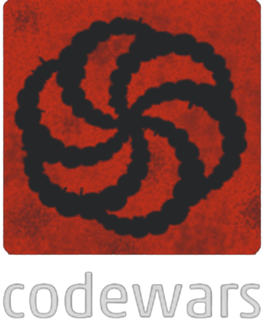
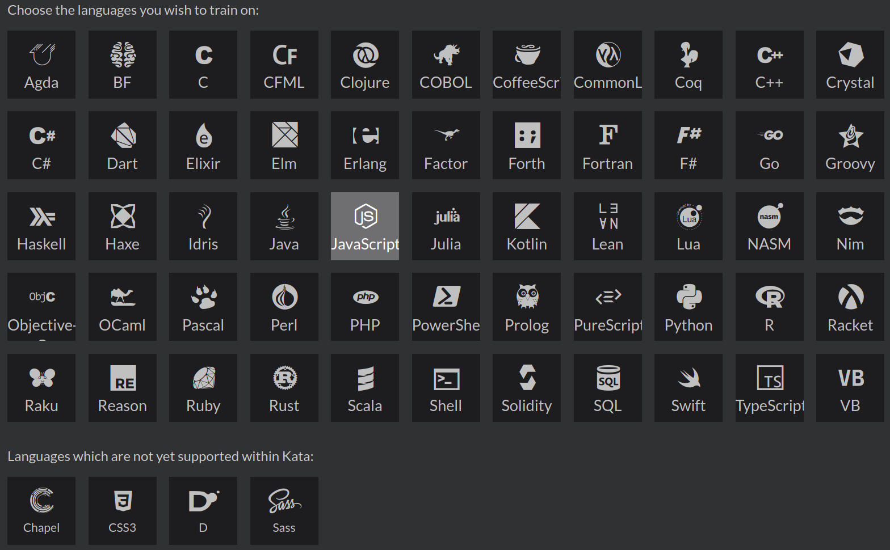
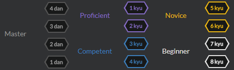

<h1 align="left">
    
</h1>

This is the GitHub repository where I save copies of the katas I've completed on
[codewars.com](https://www.codewars.com/).

<h2>What is CodeWars?

It's a website where you face challenges, you can evolve your programming skills and even learn a new language!

## Languages

<h1 align="center">
    
</h1>

## Leveling System

<h1 align="center">
    
</h1>

 

## List of Challenges

  
<b>JavaScript</b>
 

- [Multiply](JavaScript/multiply-8kyu.js) - 8 kyu

- [Convert a boolean to string](JavaScript/boolean_to_string-8kyu.js) - 8 kyu

